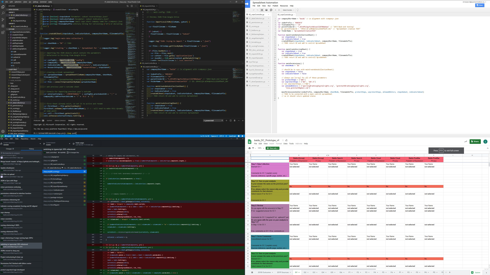

# RDR Spreadsheet Engineering

> Brace yourself: [Why software projects take longer than you think – a statistical model](https://erikbern.com/2019/04/15/why-software-projects-take-longer-than-you-think-a-statistical-model.html)

—

## TOC

+ [Intro](#intro)
+ [Quick Start](#quick-start)
+ [Changelog](#changelog)
+ [Documentation](#documentation)

—

## Intro

This is the project folder for RDR's spreadsheet automation & data pipeline development.

(*The development environment. Clockwise: VSCode+clasp; Google Apps Script; GitHub; Spreadsheet Output on Drive*)

The ~~current~~ former scope of the Spreadsheet development was to automate the generating ("casting") of spreadsheets for company-level data collection (DC) and for scoring (SC) with as few manual effort as possible. In addition we wanted to enable layout-independent querying of input data (by ID vs. static Kartesian range system G5!B14:D19). The project has grown since it's inauguration in August 2019, mostly based on demand and feature discoveries during the 2019/20 Pilot, resulting in the introduction of additional modules (such as a scores aggregation or company feedback request forms) and functionalities.

## Features

Currently, the application's **core features** allow to auto-generate:

  + company-level input spreadsheets
  + company-level scoring spreadsheets
  + company-level feedback request spreadsheets ("forms")
  + summary scores spreadsheets
  + horizontal review spreadsheets
  + company level data stores (tidy results & scores data)
 
 In addition, **additional modules** and functions allow to:
 
+ audit & maintain input sheet integrity (restoring named ranges with manipulating content)
+ update non-data parts (denominators, element level descriptions, formatting)
+ fetch Google Drive activity statistics for files and folders

**Current project  goals:**

+ implement permission management
+ integrate & automate a step-wise company-level data flow starting with the previous Index' results
+ develop & test a management dashboard, which provides an overview of research progress and identifies anomalies and other prompts for manual action (i.e. upon the return of company feedback)
+ Connect Data Store Module to external DB & enable RESTful POST UPDATE([IDs])

**Current work-in progress:**

+ map folder structure
+ change range level permissions
+ change file level permission

— 

## Environment

The environment utilizes [Google Apps Script](https://developers.google.com/apps-script/) (short: GAS]) (which is mostly a JavaScript flavor with G-Suite specific classes and methods), and the respective [Google Apps Script API](https://www.google.com/script/start/). Code is executed through the [browser](https://script.google.com/home/my) and runs online on Google's servers. Output is stored in Google Drive. 

While you *can edit* and maintain the code in Google's web editor, this is strongly discouraged. To enable proper versioning, [SSOT](https://en.wikipedia.org/wiki/Single_source_of_truth), code-sharing, collaboration, formatting consistency (`eslint` & `.editorconfig`) issue-tracking, and so on, it is recommended **to use Git, [`clasp`](https://github.com/google/clasp), and `VSCode` (for consistency and easier integration with NodeJS/npm). This setup enables you to edit code locally with a proper development environment, version your code in a git* repository, and deploy the code to GAS to execute online.

> **TL;DR:**
>
> + define parameters in JSON files (indicators, companies, research steps, Index parameters)
> + develop locally
> + deploy & run online

Following the initial proof-of-concept with G.W., the `project` has been migrated ~~to the `rdresearch` G-Suite account~~. In theory, you can share projects with other accounts in the same manner as you share any Google File. However, executing the code with any other account than `rdresearch` is not authorized currently (leads to error: `admin_policy_enforced`; probable scope: `https://www.googleapis.com/auth/script.external_request`). This will change soon by migrating the production environment from rdresearch@oti to dev@rdr.

## Conventions

+ Google Apps Script uses `*.gs` as the filetype, while regular Javascript uses `.js`. We can (*should*) stick to `.js`(or `.ts` for TypeScript) and ignore implications as clasp auto-converts between file types.

+ **IMPORTANT**: Keep in mind that the source code is stored in git. Any code changes you make in the online editor won't be fed back into git, unless you use `clasp pull` from your IDE (**danger!!!**) or copy/paste code from your browser into git. If you `push` \ `pull`, **all target folder's files will be overwritten**.

— 

## Quick Start

1. log-in as `rdresearch`
2. open [My Projects](https://script.google.com/home/my) to get an overview of your GAS projects or go directly to the [`Spreadsheet Automation` project](https://script.google.com/a/opentechinstitute.org/d/1ZrUTGLLDXMZxkDB8BRaBpPb-p4ObTJrKI8FfJUN6cL10Iggc0TTalSC5)
3. `00_mainController.gs` should open automatically. If not, open the script. This is the **main interface** to config and run all **core** modules.
4. ~~edit `companyShortName` in alignment to the according `<company>.json` (see the [JSON folder](/json/))~~ (now vectorized; subset with `.slice(0,1)`)
5. double-check `outputFolderName` if you need a specific folder for your outputs (folder will be a subfolder of `2019 Back-end testing` owned by `rdresearch`; if you want to change the parent folder, you need to replace the folder **id**  of `rootFolderID`)
6. edit the `subset` variables in the `mainAllCompanies<Function>()` caller of the module you want to run (i.e. define whether you want to run only a subset of research steps)
7. in the sub-menu (grey), choose the function to run, and click play.
8. wait for the script to finish. When done, optionally hit `Ctrl + Enter` to inspect the log.
9. open the output folder in Google Drive (should be under `My Drive`) and inspect the output
10. if you created new data collection sheets: open `00_Test` spreadsheet and copy the DC Spreadsheet IDs to the 

> If you created new data collection or scoring Spreadsheets, and you intend to continue working with them, make sure to grab the new file IDs from `00_Test` spreadsheet and update them for the respective `01_JSON_companies.js/<company>`, i.e. params

+ `companies.<company>.urlCurrentDataCollectionSheet`
+ `companies.<company>.urlCurrentCompanyScoringSheet`

Otherwise, you will have to update `=IMPORTRANGE(ID)` in the spreadsheets by hand.

> If you run into runtime issues (e.g. endless loop), you can inspect and **terminate** current executions under [My Executions](https://script.google.com/u/3/home/executions). The status in the online editor is just a front-end gimmick and is actually not at all connected to the execution itself, i.e. you can refresh or close the browser and/or start a new execution, and it will not impact the one already running.

—

## Changelog

> Moved to [**Changelog.md**](docs/CHANGELOG.md)

—

## Detailed Documentation

> To keep things readable, the documentation is maintained in a separate document.

+ [**Documentation**](docs/documentation.MD)
