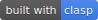
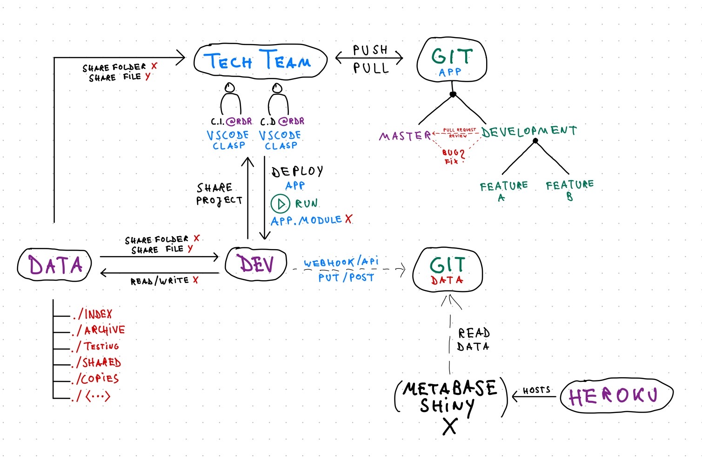

# RDR Spreadsheet Engineering

> [Drive Project link](https://script.google.com/d/1rZM9rFC9zFPkbxgTzqRBbynz60Bo5xRcdBpL9yi9l6TksLBkJNDAk2Wv/edit)

> Brace yourself: [Why software projects take longer than you think – a statistical model](https://erikbern.com/2019/04/15/why-software-projects-take-longer-than-you-think-a-statistical-model.html)

---

## TOC

+ [Documentation](#documentation)
+ [Intro](#intro)
+ [Features](#features)
+ [Quick Start](#quick-start)
+ [Changelog](#changelog)
+ [Numbers](#numbers)

---

## Documentation

> To keep things readable, the documentation is maintained in a separate document.

+ [**Detailed Documentation**](docs/documentation.md)

## Intro

This is the master repository for RDR's spreadsheet automation & data pipeline development.

(*Mapping of the Data Infrastructure setup as of April 2020*)

The ~~current~~ former scope of the Spreadsheet development was to automate the generating ("casting") of spreadsheets for company-level data collection (DC) and for scoring (SC) with as few manual effort as possible. In addition we wanted to enable layout-independent querying of input data (by ID vs. static Kartesian range system G5!B14:D19). The project has grown since it's inauguration in August 2019, mostly based on demand and feature discoveries during the 2019/20 Pilot, resulting in the introduction of additional modules (such as a scores aggregation or company feedback request forms) and functionalities.

The **current Scope** of the project is to complete an end-to-end data pipeline (spanning from previous Index' data to the final outputs from the current Index cycle).

## Features

Currently, the application's **core features** allow to auto-generate:

+ company-level input spreadsheets
+ company-level scoring spreadsheets
+ company-level feedback request spreadsheets ("forms")
+ summary scores spreadsheets
+ horizontal review spreadsheets
+ company level data stores (tidy results & scores data)

In addition, **additional modules** and functions allow to:

+ audit & maintain input sheet integrity (restoring named ranges with manipulating content)
+ update non-data parts (denominators, element level descriptions, formatting)
+ fetch Google Drive activity statistics for files and folders

**Current project  goals:**

+ [ ] migrate from rdresearch to data@rdr & dev@rdr
  + [x] code & authentication
  + [ ] data
+ [ ] implement permission management
+ [ ] integrate & automate a step-wise company-level data flow starting with the previous Index' results
+ [ ] develop & test a management dashboard, which provides an overview of research progress and identifies anomalies and other prompts for manual action (i.e. upon the return of company feedback)
+ [ ] Connect Data Store Module to external DB & enable RESTful POST UPDATE([IDs])
+ [ ] migrate to `ES6` as soon as ~~ it is available **stable** ~~ possible for GAS (cf. [v8 runtime](https://www.labnol.org/es6-google-apps-script-v8-200206); [Google's overview](https://developers.google.com/apps-script/guides/v8-runtime); [good ES6 Intro](https://medium.com/better-programming/modern-javascript-techniques-cf2084236af4))

**Current work-in progress:**

+ map folder structure
+ change range level permissions
+ change file level permission

---

## Environment

The environment utilizes [Google Apps Script](https://developers.google.com/apps-script/) (short: GAS) (which is mostly a JavaScript flavor with G-Suite specific classes and methods), and the respective [Google Apps Script API](https://www.google.com/script/start/). Code is executed through the [browser](https://script.google.com/home/my) and runs online on Google's servers. Output is stored in Google Drive.

While you *can edit* and maintain the code in Google's web editor, this is strongly discouraged. To enable proper versioning, [SSOT](https://en.wikipedia.org/wiki/Single_source_of_truth), code-sharing, collaboration, formatting consistency (`eslint` & `.editorconfig`) issue-tracking, and so on, it is recommended **to use Git, [`clasp`](https://github.com/google/clasp), and `VSCode` (for consistency and easier integration with NodeJS/npm). This setup enables you to edit code locally with a proper development environment, version your code in a git* repository, and deploy the code to GAS to execute online.

> **TL;DR:**
>
> + define parameters in JSON files (indicators, companies, research steps, Index parameters)
> + develop locally
> + deploy & run online

Following the initial proof-of-concept with G.W., the `project` has been migrated ~~to the `rdresearch` G-Suite account~~. In theory, you can share projects with other accounts in the same manner as you share any Google File. However, executing the code with any other account than `rdresearch` is not authorized currently (leads to error: `admin_policy_enforced`; probable scope: `https://www.googleapis.com/auth/script.external_request`). This will change soon by migrating the production environment from rdresearch@oti to dev@rdr.

## Conventions

+ **Rule #1: never develop in master branch**. Always use a dedicated feature development branch forked from `development`. Never directly merge into master. **Always** use pull requests and let someone else on the team review the request. **Never** touch `-freeze` branches.
+ Google Apps Script uses `*.gs` as the filetype, while regular Javascript uses `.js`. We can (*should*) stick to `.js`(or `.ts` for TypeScript) and ignore implications as clasp auto-converts between file types.
+ **IMPORTANT**: Keep in mind that the source code is stored in git. Any code changes you make in the online editor won't be fed back into git, unless you use `clasp pull` from your IDE (**danger!!!**) or copy/paste code from your browser into git. If you `push` \ `pull`, **all target folder's files will be overwritten**.

---

## Quick Start

> Local [Setup](docs/setup.md) instructions

1. log-in with your regular @rdr account
2. open [Script/All Projects](https://script.google.com/home/all) to get an overview of your GAS projects or go directly to the [`Datalab` project](https://script.google.com/a/rankingdigitalrights.org/d/1rZM9rFC9zFPkbxgTzqRBbynz60Bo5xRcdBpL9yi9l6TksLBkJNDAk2Wv/edit)
3. `00_mainController.gs` should open automatically. If not, open the script. This is the **main interface** to config and run all **core** modules.
4. ~~edit `companyShortName` in alignment to the according `<company>.json` (see the [JSON folder](/json/))~~ (now vectorized; subset with `.slice(0,1)`)
5. double-check `outputFolderName` if you need a specific folder for your outputs (folder will be a subfolder of ~~`2019 Back-end testing`~~ (tbd) owned by `data@`; if you want to change the parent folder, you need to replace the folder **id**  of `rootFolderID`) **and** grant yourself and `dev@` access rights to the folder
6. edit the `subset` variables in the `main<Function>()` caller of the module you want to run (i.e. define whether you want to run only a subset of research steps)
7. in the dropdown-menu (grey), choose the function to run, and click play ▶️ to execute the function.
8. wait for the script to finish. When done, optionally hit `Ctrl + Enter` to inspect the log.
9. open the output folder in Google Drive (should be under `My Drive`) and inspect the output
10. if you created new data collection sheets: open `00_Dashboard` spreadsheet and copy the DC Spreadsheet IDs to the

> If you created new data collection or scoring Spreadsheets, and you intend to continue working with them, make sure to grab the new file IDs from `00_Dashboard` spreadsheet and update them for the respective `01_JSON_companies.js/<company>`, i.e. params

+ `companies.<company>.urlCurrentDataCollectionSheet`
+ `companies.<company>.urlCurrentCompanyScoringSheet`

Otherwise, you will have to update `=IMPORTRANGE(ID)` in the spreadsheets by hand.

> debugging #1\
> If you run into runtime issues (e.g. endless loop), you can inspect and **terminate** current executions under [My Executions](https://script.google.com/u/3/home/executions). The status in the online editor is just a front-end gimmick and is actually not at all connected to the execution itself, i.e. you can refresh or close the browser and/or start a new execution, and it will not impact the one already running.
> In the same place you can see the verbose output (from `console.log` and the latest error messages) if you uncollapse the row.

---

## Changelog

> Moved to [**Changelog.md**](docs/CHANGELOG.md)

## Numbers

Current Dimension: `Lines of Code` (2020-04-27):

> (see ./docs/stats/cloc.sh)\
> run `cloc` from root with `sh ./docs/stats/cloc.sh`\
> new: run `npm run <stat>` from terminal with <stat> := [cloc, json, docs]

### JavaScript / Code

#### Summary

Language|files|blank|comment|code
:-------|-------:|-------:|-------:|-------:
JavaScript|44|2015|1231|4097
--------|--------|--------|--------|--------
SUM:|44|2015|1231|4097

#### Detailed

File|blank|comment|code
:-------|-------:|-------:|-------:
src/12_inputSubBaseModules.js|196|89|440
src/23_scoringSubcomponents.js|184|88|392
src/12_inputSubYonY.js|205|120|371
src/72_repairSubcomponents.js|181|69|364
src/42_feedbackHelper.js|90|32|232
src/33_aggregationHelper.js|69|40|163
src/11_inputMainProcess.js|78|61|143
src/99_SpreadsheetOperations.js|43|32|129
00_mainController.js|77|88|123
src/63a_dataStorageComponentsWide.js|49|29|108
src/98_driveOperations.js|22|9|105
src/999_drive_activity.js|58|65|100
src/96_scoringFormulasHelper.js|33|4|100
src/999_driveActivityThesis.js|58|65|100
src/22_scoringSingleStepProcess.js|44|13|97
src/63b_dataStorageComponentsLong.js|44|19|89
src/13_old_inputPermissions.js|43|35|86
src/41_feedbackInterface.js|48|17|82
src/62b_dataStorageSingleStepLong.js|38|15|68
src/10_inputInterface.js|44|37|68
src/61_dataStorangeInterface.js|36|18|64
src/62a_dataStorageSingleStepWide.js|28|8|60
src/30_aggregationMain.js|41|26|60
src/999_driveFilestructure.js|30|30|56
src/72_repairBrokenREF.js|54|68|54
src/91_defaultSheets.js|15|1|54
src/40_feedbackMain.js|26|13|51
src/21_scoringInterface.js|20|8|37
src/71_repairInterface.js|20|9|34
src/95_formattingHelper.js|3|2|30
src/92_findItems.js|10|4|26
src/20_scoringMain.js|18|12|24
src/32_aggregationCompanySummary.js|20|24|24
src/99_importJSON.js|15|14|23
src/72_listBrokenREF.js|4|0|21
src/60_dataStorageLayer.js|16|24|21
src/70_repairSpreadsheets.js|14|15|20
src/31_aggregationInterface.js|11|8|18
src/92_rangeNamingHelper.js|8|5|16
src/92_fileNamingHelper.js|6|1|14
src/93_dataHelpers.js|5|0|13
src/79_clearNamedRanges.js|8|0|12
src/991_object_helpers.js|0|0|5
src/997_external_libraries_js.js|3|14|0
--------|--------|--------|--------
SUM:|2015|1231|4097

### Input Vectors / JSON

#### Summary

Language|files|blank|comment|code
:-------|-------:|-------:|-------:|-------:
JSON|11|0|0|2615
JavaScript|4|5|6|2471
--------|--------|--------|--------|--------
SUM:|15|5|6|5086

#### Detailed

File|blank|comment|code
:-------|-------:|-------:|-------:
./json/JSON_indicators.js|2|0|1562
./json/deprecated/indicators.json|0|0|1087
./json/deprecated/indicatorsSubset.json|0|0|579
./json/JSON_researchSteps.js|1|0|524
./json/deprecated/researchSteps.json|0|0|463
./json/JSON_companies.js|2|2|287
./json/deprecated/researchStepsSubset.json|0|0|215
./json/JSON_config.js|0|4|98
./json/deprecated/facebook.json|0|0|51
./json/deprecated/etisalat.json|0|0|46
./json/deprecated/mtn.json|0|0|45
./json/deprecated/baidu.json|0|0|43
./json/deprecated/apple.json|0|0|43
./json/deprecated/verizon.json|0|0|38
./json/deprecated/config.json|0|0|5
--------|--------|--------|--------
SUM:|5|6|5086

### Documentation / Markdown

#### Summary

Language|files|blank|comment|code
:-------|-------:|-------:|-------:|-------:
Markdown|6|268|0|565
Bourne Shell|3|9|12|18
--------|--------|--------|--------|--------
SUM:|9|277|12|583

#### Detailed

File|blank|comment|code
:-------|-------:|-------:|-------:
docs/documentation.md|148|0|226
README.md|53|0|152
docs/dictionary.md|35|0|77
docs/CHANGELOG.md|21|0|73
docs/setup.md|10|0|34
docs/stats/cloc.sh|3|4|6
docs/stats/json.sh|3|4|6
docs/stats/docs.sh|3|4|6
docs/QC.md|1|0|3
--------|--------|--------|--------
SUM:|277|12|583
