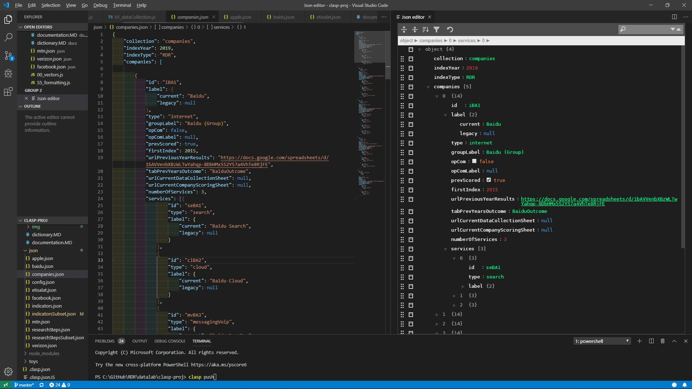
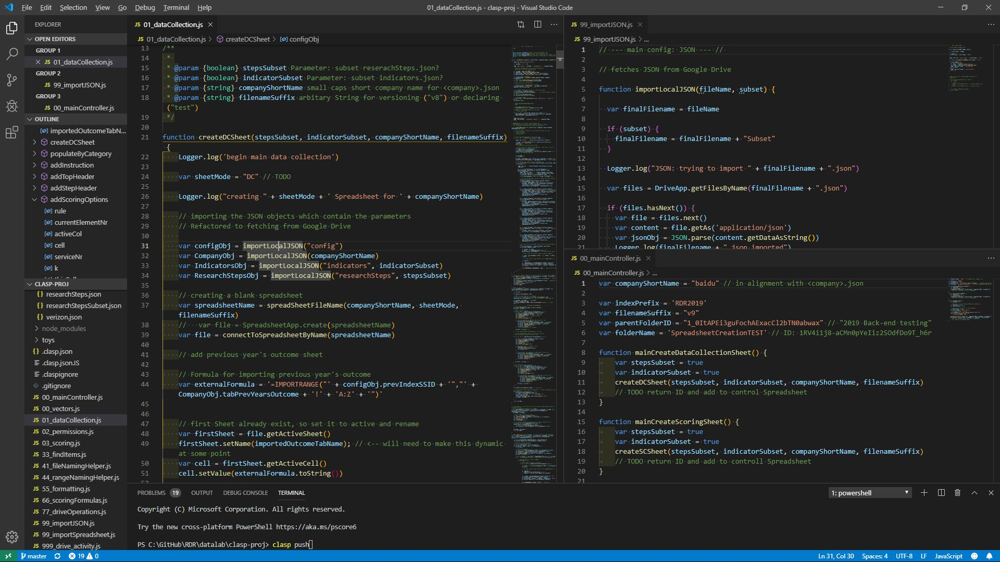

# Documentation

> -> Go back to [README](../README.MD)\
> -> Jump to [JSON Dictionary](dictionary.MD)
## TOC

+ [Intro](#intro)
+ [Architecture / Ecosystem](#intro)
  + [Main Modules](#intro)
  + [Helper Modules](#intro)
  + [JSON](#intro)
+ [Environment & Recommended Setup](#intro)
+ [Google Apps Script / Apps API](#intro)
+ [Clasp & IDE](#intro)
+ FAQ
+ Issues

## Intro

> Following the initial development of the data collection spreadsheets by G.W. and I.S., the whole project has been extended and fundamentally restructured and refactored. There's still a lot of clean-up and refactoring tbd, but so far, the core modules and features are maintainable, naming of the ranges is centralized, the project can output to specific folders (within allowed scope) and so on.

To provide contributors with a cognitive model of this project, it is helpful to distinguish between 

+ the development environment (the source code stored on `git`, edited locally with an editor, `clasp` for syncing with Google),
+ the execution / runtime environment (Google Apps Script online editor),
+ and the output environment (Google Drive).

Currently, the `JSON` files build the fourth component as they are stored on a stage server. This has to be changed yet, and has been changed for the companies vector.

## Architecture / Ecosystem

The core idea is that,
    
a) based on a set of `parameter vectors` (indicators, research steps, companies) **currently** provided as JSON files and JSON objects (`01_JSON_companies.js`)

b) for each `company` you

+ first create the `data collection spreadsheet` with `mainAllCompaniesDataCollectionSheets()`, which will be located in `rootFolderID/outputFolderName` of `@rdresearch`'s Drive.

  > The `fileID` of this new spreadsheet should then be added to `urlCurrentDataCollectionSheet` in the respective `01_JSON_companies.js/<company>` Object.

+ currently defunct: ~~to set step-wise editing `permissions` for the data collection sheet, run `mainPermissions()`~~

+ then create the `company scoring sheet` with `mainCreateScoringSheet()`.

  > ~~In the near future~~ Currently, all outputs are tracked in a `00_Test`.

Eventually, all control should be moved to a `Master Spreadsheet`.

### Main Modules

The basic structure is now modular, with control modules starting with `0x` and core modules being in `1x` (DC), and `2x` (SC).

Core modules have been split into a main high-level caller (`x0`) and lower-level helper (`x1`, `x2` and so on) to upheld readability and enable affordable maintenance.

As modules were subsequently introduced, and eventually refactored, most modules and methods operate on the same set of parameters. Therefore, if you make changes to e.g. `researchSteps.step.component.labelShort` JSON while working on `10_dataCollectionMain.js`, you need to apply this structural change to all modules concerned (**incl. Helpers**)  as it might (or rather **will**) break e.g. `21_scoringComponents.js`.

**Modules**:

+ Main Controller
  
  > `00_mainController` - supposed to be the central touchpoint for any activity.

  Here you define some global variables such as the `Index prefix`, and the target output folder, or whether to use subsets, and then run the respective modules for creating sets of data collection (DC) spreadsheets or sets of company-level scoring (SC) spreadsheets from the main controller. The third module is setting permissions for the data collection sheets, which is currently not maintained.

  Each main method call picks up the global parameters for using subsets of indicators or subsets of research steps. Right now, these subsets are hardcoded in JSON files which are then assigned in `99_importJSON`.

  To subset companies, currently you have to stick to `companies.slice(indexOfFirstCompany,length)` in the respective caller.

+ Data Collection Spreadsheets

  > `10_dataCollectionMain.js` - core module for the creation of a single company-level data collection spreadsheet

  > `11_dataCollectionComponents.js` - lower-level helper functions for the data collection production

  Extensive documentation was created by G.W. ([GDoc](https://docs.google.com/document/d/1972r43uMNTdPMm3xFhtmOvHN3f8S8P1XEzwzju3soCo/edit)). Due to exhaustive refactoring and restructuring it needs to be updated.

  > `12_permissions.js` - core module for setting / removing step-wise permission for `data collection spreadsheets` - currently not operational

  + currently, step-wise for step: 1 & 1.5; step: 2; Protecting works; un-protecting / assigning editors de-facto not effective with external users (due to missing scope permission). As we are currently using `rdresearch`, and all non-OTI accounts are external...
  + in theory, generic enough to be applied to any class of spreadsheets, if `named Ranges` utilise the `Steps` suffix.

+ Company Scoring Spreadsheets

  > `20_scoringMain.js` (TBD)

  > `21_scoringComponents.js` (TBD)

  > Best, add `DC fileID` to `<company>.json` before casting `SC`

### Helper Modules

+ importJSON
+ scoringFormula
+ rangeNaming
+ cellFormatting
+ fileNaming
+ importSpreadsheet
+ driveOperations
+ findItems

### JSON

+ Git --> Drive

  + research steps
  + indicators
  + config (not operational yet)

+ Git-only

  + `01_JSON_companies.js` & `var = companiesObj {}`
  + tbd: `ssh` into `git`

#### Research Steps

> currently redundant, therefore no SSOT. Need to introduce parameterized subsetting functions

+ all
+ subsets

#### Indicators

> currently redundant, therefore no SSOT. Need to introduce parameterized subsetting functions

+ all
+ subsets

#### Companies JSON

> perliminary: make sure that **services children are listed in order** of previous Index' listing (i.e. prepaid, postpaid, broadband)

+ **Guidelines**

  + use 1-letter category `prefix` for companies and 2-letter `prefix`for services
  + **Authoritative**: [Dictionary](dictionary.MD)
  + use a GUI JSON editor for validation of JSON syntax (i.e. VSCode + [JSON Editor](https://marketplace.visualstudio.com/items?itemName=nickdemayo.vscode-json-editor) `plugin`, or [JSON Editor Online](https://jsoneditoronline.org/))

(*Screenshot: VSCode with JSON Editor Plugin: JSON file is opened on the left, the visual editor on the right.*)

#### Config

> should define Index, methodology / sets, companies, folders, maybe map editors to companies

---

## Environment & Recommended Setup

### Google Apps Script / Apps API

+ weird mix of JS 1.6 - 1.8 (ES4-ES6)
+ we added some core ES6 methods via manual but official polyfill (`Array.find()`, `Object.entries()`)

*Motivational* quote: 

> "The GAS is not a precise version of JavaScript. It supports many features of JavaScript 1.8.5 like Object.keys, Object.isExtensible, etc. but on the other hand it does not support the keywords yield and let introduced in JavaScript 1.7. Another features which the GAS supports are the native JSON class and String.trim function introduced in JavaScript 1.8.1. Also the GAS supports the E4X extension.
>
>The GAS documentation is not complete now and many features are discoverable **experimentally**." [Source](https://stackoverflow.com/a/12280297)

+ [Documentation GAS](https://developers.google.com/apps-script)
+ [GAS Best practices](https://developers.google.com/apps-script/guides/support/best-practices)
+ [SO/google-apps-script](https://stackoverflow.com/questions/tagged/google-apps-script)
+ [SO/corey-g](https://stackoverflow.com/users/1491380/corey-g) (former GAS engineer)

### Clasp & IDE

(*Screenshot: VSCode with tripartite Layout: `01_dataCollection.js` on the left; `99_importJSON.js` helper module on the top right; `00_mainController.js` on the bottom right. Terminal with `clasp push` on the bottom.*)

+ npm clasp
+ npm types/@google-apps-script
+ .claspignore
+ .gitignore
+ typescript.json
+ switching of accounts

## FAQ

> Q: Can we...?\
> A: Njet.

+ general source for GAS discussions: 

## Issues

+ Permissions https://stackoverflow.com/questions/10796464/transfer-ownership-of-a-file-to-another-user-in-google-apps-script

### Learnings

+ if you update existing files, named ranges are not removed by sheet.clear()
+ max. runtime is 30 minutes / 1800 seconds. If your script breaks due to runtime error, you can see the log (Ctrl+Enter in the online editor) to see which company was processed last, delete the output for this company, and re-run the script with a subset, starting with the unfinished company.
+ also, you can run multiple scripts in parallel...

### To be explored

+ Collaboration:

    "If you are working on a script project with other developers, you can collaborate on Apps Script projects with shared drives. Files in a shared drive are owned by the group, rather than individuals. This makes development and maintenance of the project easier." [GAS Best practices](https://developers.google.com/apps-script/guides/support/best-practices#consider_collaborating_with_shared_drives)

+ Refactoring:

  + start with VSCode [refactoring](https://code.visualstudio.com/docs/editor/refactoring)
  + see [array vs cell-based operations](https://stackoverflow.com/questions/35289183/long-processing-time-likely-due-to-getvalue-and-cell-inserts)
  + [arrays in GAS in general](https://stackoverflow.com/questions/49020131/how-much-faster-are-arrays-than-accessing-google-sheets-cells-within-google-scri)
